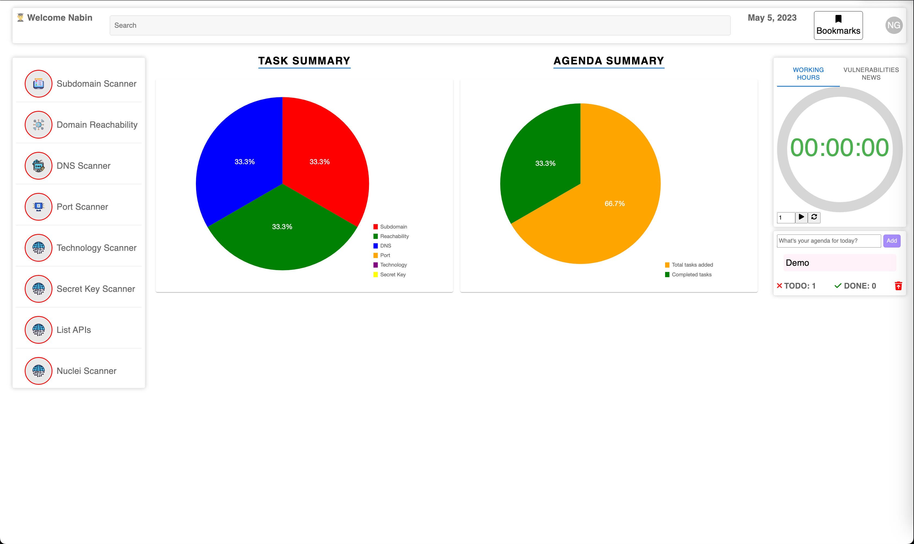
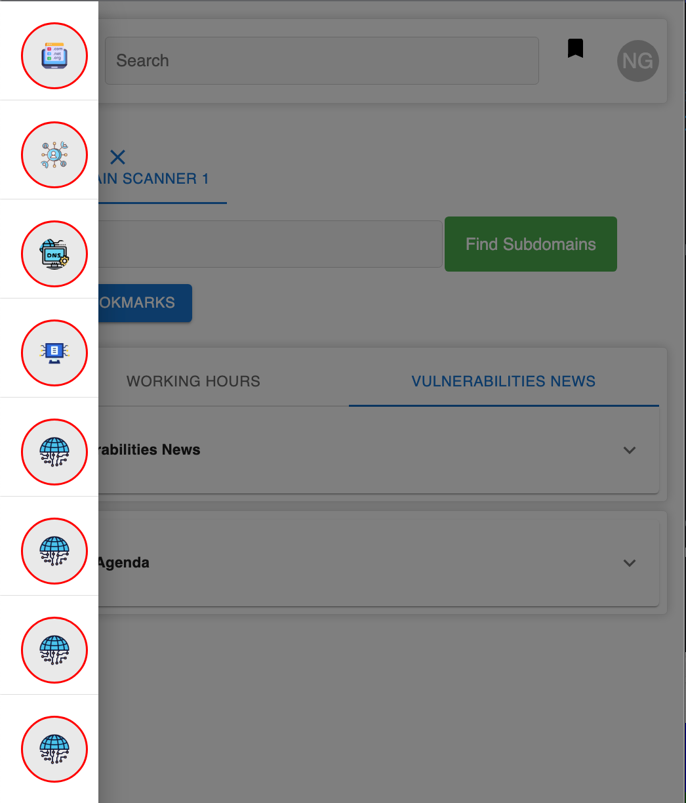

# BugYet

BugYet is a comprehensive and user-friendly web application designed to facilitate automated vulnerability detection for penetration testers and ethical hackers, regardless of their skill level.

Combining several essential features such as automated subdomain scanning, domain reachability testing, firewall detection, and vulnerability scanning with crowd-sourced templates, BugYet optimizes the bug-hunting process and ensures users stay informed on the latest security threats.

Moreover, the application provides secret key detection, web technology detection, and customizable notifications, enabling a tailored user experience. With regular updates and constant innovation, BugYet aims to simplify the tasks of cybersecurity professionals and enthusiasts while enhancing their ability to safeguard valuable online assets.

## Features List (WIP) ✨

- Automated subdomain scanning
- Domain reachability testing
- Firewall detection
- Vulnerability scanning with crowd-sourced templates
- Secret key detection
- Web technology detection
- Customizable notifications
- User-friendly interface
- Responsive design for desktop and mobile devices
- Continuous updates with the latest security threats
- Secure user authentication with signup and signin pages
- JSON Web Token (JWT) stateless authentication for enhanced security

## Demo Images

### Desktop

### Mobile

## Installation & Setup

1. Rename `example.env` to `.env` and populate the necessary values.
2. Run the `install.js` script for installation.
3. To start the program, execute the `start.js` script.

---

That's all you need to set up and run BugYet. Enjoy hunting for vulnerabilities and securing your online presence!

[MIT License](LICENSE)